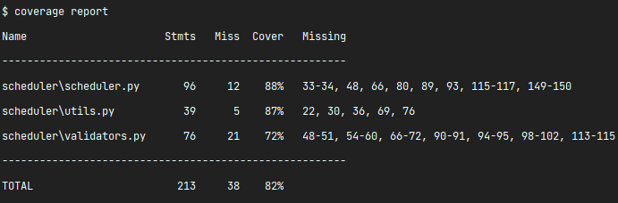
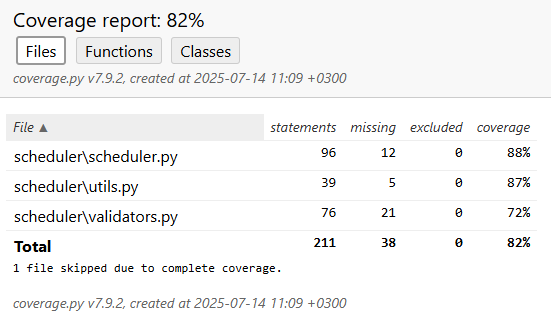

# scheduler

## Установка

1. **Клонируйте репозиторий:**

- ```git clone git@github.com:Faithdev21/scheduler.git```
- ```cd scheduler/```

2. **Создайте виртуальное окружение:**

   - ```python -m venv venv```
   - ```source venv/bin/activate```  **# для Linux/Mac**
   - ```source venv/Scripts/activate```    **# для Windows**
3. **Установите зависимости:**

   ```
   pip install -r requirements.txt
   ```

## Запуск проекта

В файле **main.py** реализованы примеры вызова всех основных функций.

````
python main.py
````

Для запуска отдельных функций комментируйте ненужные функции


## Запуск тестов

```
pytest
```

или

```
python -m pytest
```

Отчет по покрытию кода тестами:

```
coverage run -m pytest
coverage report
```



Для просмотра в html:

```
coverage html
```

Дальше запустить index.html из директории htmlcov/



### Проверка кода по PEP8:

```
flake8 scheduler/
```
